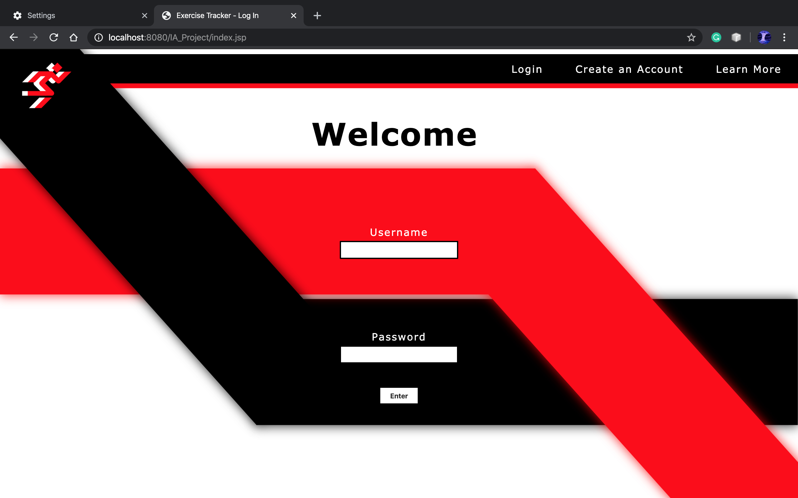
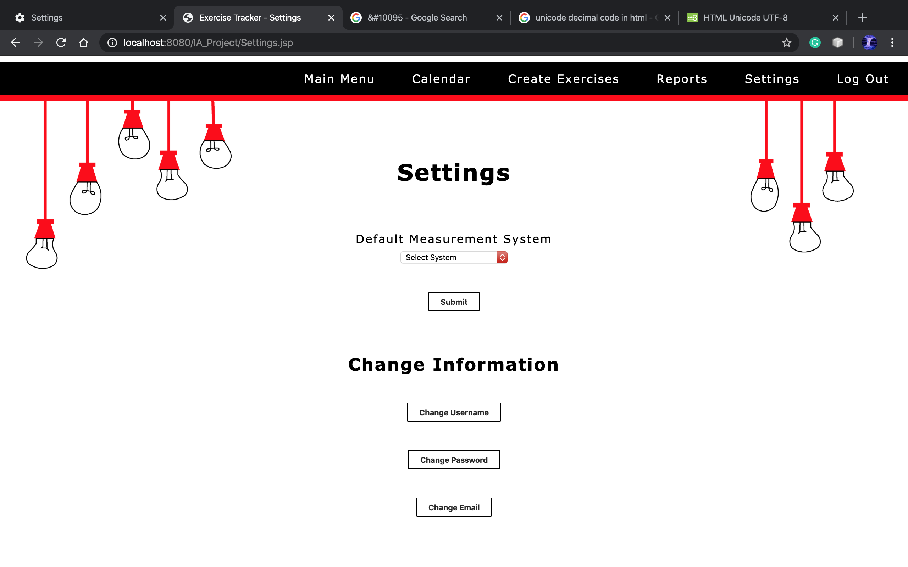
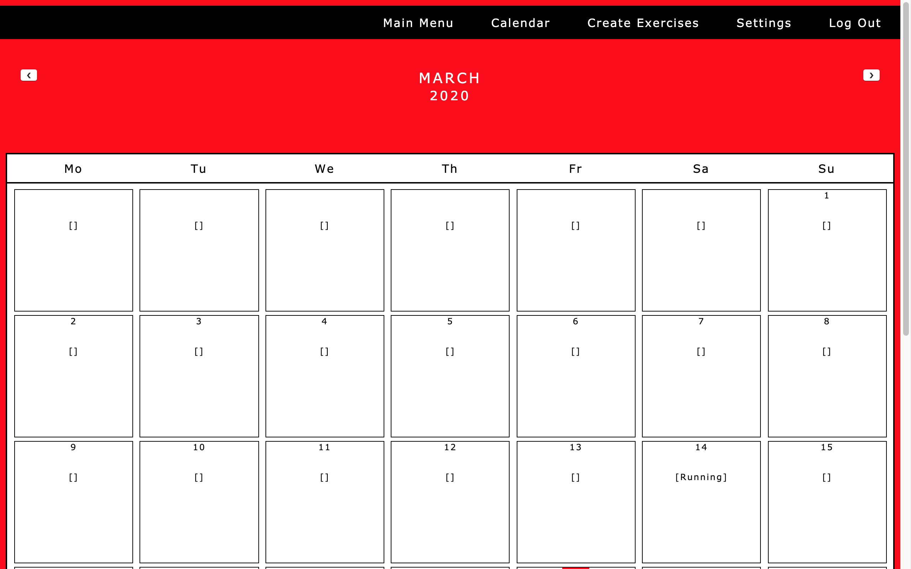

    <h1>
         
        Fitness Tracker
    </h1>

A fitness tracker web application. Utilizes JSP, JSF/Servlets and a Java DB database in SQL.

## Design

    

        
        
 UML Diagram 

    

    

        
        
 Flow Chart 

    

## Pages

    

        
        
 Login Screen 

    

    

        
        
 New Account 

    

    

        
        
 Main Menu 

    

    

        
        
 New Exercise Page 1 

    

    

        
        
 New Exercise Page 2 

    

    

        
        
 Manage Exercise

    

    

        
        
 User Settings 

    

    

        
        
 Change Username 

    

    

        
        
 Calendar 

    

## SQL Tables

### Users
| Variable        | Type |
| :---------------- | :------ |
| id             |   Integer (non-null, primary key, auto-inc)   |
| FirstName           |   Varchar(255)   |
| LastName           |   Varchar(255)   |
| Email           |   Varchar(255)   |
| Username           |   Varchar(255)   |
| Password           |   Varchar(255)   |
| MeasurementSystem           |   Varchar(255)   |

### Exercises
| Variable        | Type |
| :---------------- | :------ |
| id             |   Integer (non-null, primary key, auto-inc)   |
| Username           |   varchar(255)   |
| Exercise | Varchar(255) |
| ExDate           |   Date   |
| ExTime           |   Time   |
| shouldEmail   | Boolean |
| Distance | Integer |
| Duration | Integer |
| Weight | Integer |
| Reps | Integer |
|ExSets | Integer |
| WeightliftType | Varchar(255) |
| SwimType | Varchar(255) |
| MAType | Varchar(255) |
| Other | Varchar(255) |
